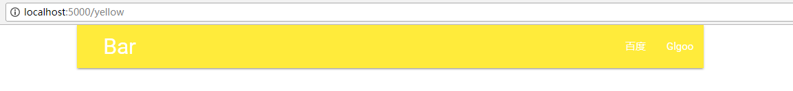
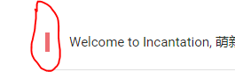

# 颜色

改变对象的颜色

假设我们需要一个根据输入自动调整颜色的网页，如下所示
[](./blue.PNGblue)
[](./yellow.PNG)
[](./purple.PNG)

应该如何写我们的代码呢?

- `colorChange.py`

    ```python

    from incantation.template import Page 
    from incantation.Module.CSS.Color import color
    from incantation.Module.CSS.Grid import container
    from incantation.Module.Component.Navbar import navbar


    from flask import Flask, g, request, render_template, url_for, redirect
    app = Flask(__name__)
    app.debug = True

    @app.route('/<ucolor>', methods=['GET'])
    def index(ucolor):
        space = '&nbsp;'
        main = container()

        bar = navbar([
                    {'name':'百度', 'href':'https://www.baidu.com'},
                    dict(name = 'Glgoo', href='https://scholar.glgoo.org/'),
                    ], 
                    href='#Bar', name = f'{space*5}Bar')
        
        html_color = color(major = ucolor).gen()

        bar.cons_class(html_color) # 从对象class的头部添加值

        main.contains(bar)
        return Page(main).gen()

    app.run('localhost')

    ```

- P.S:  
在Materialize-CSS中，一个对象的颜色，由class之中的值所确定。
    ```HTML
    <!-- 红色 -->
    <div class="xxx red">  
    ...
    </div>
    ```


但不是所有的对象都可以改变颜色，例如，`blockquote`左侧的标志。  
[](./except.PNG)  
如果你按上面的代码改变其颜色，将会把`blockquote`整块染色。