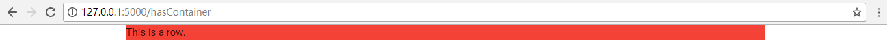
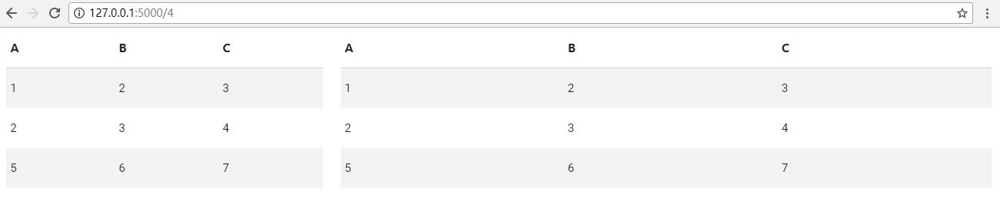
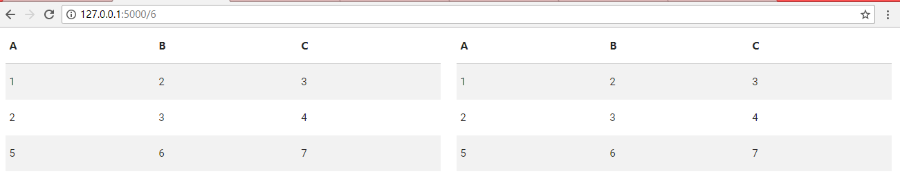

# 布局

不妨查看materialize-css的[grid](http://materializecss.com/grid.html).

## Container

首先有一个对象叫做container, 它的作用是这样的。

- `No Container`
[](./noContainer.PNG)

- `Has Container`
[](./hasContainer.PNG)

代码如下:

```python
from incantation.template import Page 
from incantation.Module.CSS.Grid import container, row
from incantation.Module.CSS.Color import color
from flask import Flask
app = Flask(__name__)
app.debug = True
def my_page(hasContainer:bool):
    a_row = row("This is a row.")
    a_row.cons_class(color('red').gen())

    if hasContainer:
        main = container()
        main.contains(a_row)
        res = main
    else:
        res = a_row
    return Page(res).gen()
@app.route('/<hasContainer>', methods=['GET'])
def index(hasContainer):
    return my_page(hasContainer == 'hasContainer')
app.run('localhost')
```

## 一行12列

- `4-8 Split`
[](./Grid48.PNG)


- `6-6 Split`

[](./Grid66.PNG)

代码如下

```python
from incantation.template import Page 
from incantation.Module.abst import Seq
from incantation.Module.CSS.Grid import  row, grid, col
from incantation.Module.CSS.Color import color
from incantation.Module.CSS.Table import table
from flask import Flask
app = Flask(__name__)
app.debug = True

def my_page(gridNum):
    gridNum = int(gridNum)
    table_example = table(["A","B","C"],
                          [[1,2,3],
                           [2,3,4],
                           [5,6,7]
                          ]).cons_class('striped')
    a_row = row(
                Seq(
                    col(table_example, grid(l = gridNum)),
                    col(table_example, grid(l = 12-gridNum)),
                    )
                )
    return Page(a_row).gen()
@app.route('/<gridNum>', methods=['GET'])
def index(gridNum):
    return my_page(gridNum)
app.run('localhost')
```


