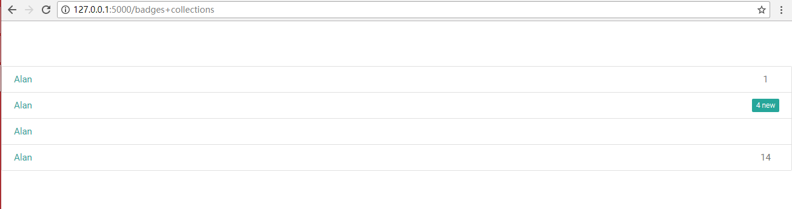
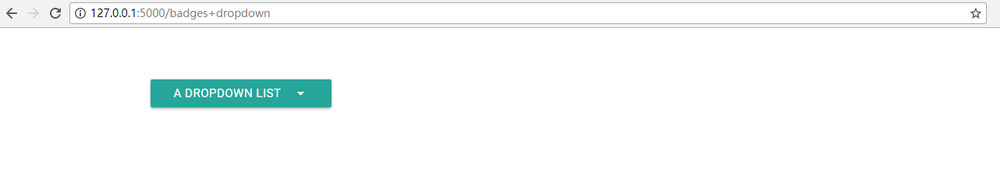
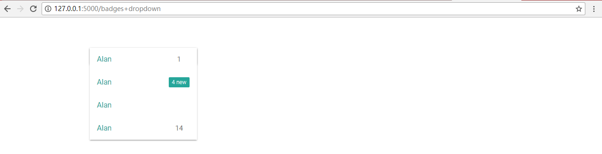
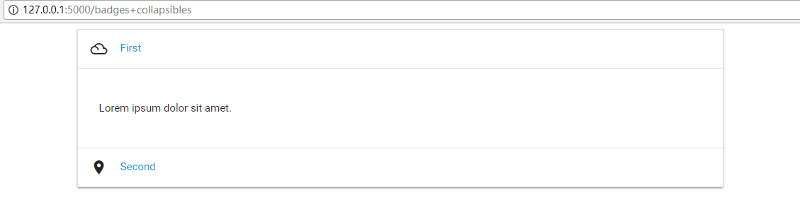

# Badges

## Collections

[](./badges+collections.PNG)

这样的东西被称为一个collection，创建上图所示collection的代码如下。

```python
collections([badge(new = False,href = '#!', num = 1, name = 'Alan'),
             badge(new = True, href = '#!', num = 4, name = 'Alan'),
             badge(href = '#!', name = 'Alan'),
             badge(new = False,href = '#!', num = 14,name = 'Alan')
            ])
```

## Dropdown

[](./badges+dropdown.PNG)

[](./badges+dropdown_click.PNG)

这样一个对象的代码如下。

```python
 dropdown([badge(new = False,href = '#!', num = 1, name = 'Alan'),
           badge(new = True, href = '#!', num = 4, name = 'Alan'),
           badge(href = '#!', name = 'Alan'),
           badge(new = False,href = '#!', num = 14,name = 'Alan')],
          name = 'a dropdown list', id = 'someid')
```

## Collapsibles

[](./badges+collapsibles.PNG)

这样一个对象的代码如下。

```python

# icon： from incantation.Module.Component.Icons import icon
collapsible([
            (icon('filter_drama'),
             badge(href = '#!', name = "First") , 
             "<p>Lorem ipsum dolor sit amet.</p>"),
            
            (icon('place'),      
             badge(href = '#!', name = "Second"), 
             "place")   
            ])
```

