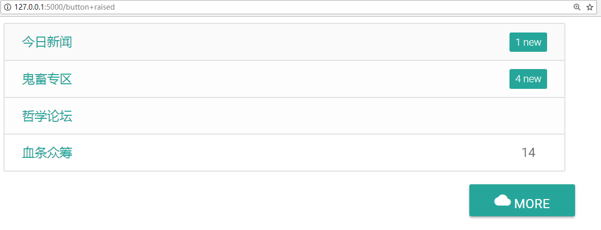
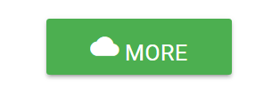
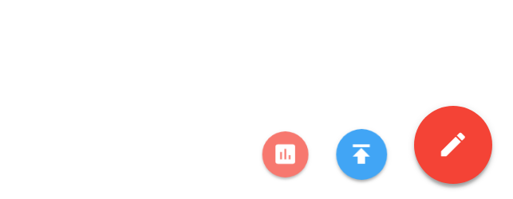

# Button

**按钮，颜值，打钱**

## Raised

[](./button+raised.PNG)

右下角这个按钮的实现如下

```python
more = raised(icon=icon('cloud'), name="  More", href='https://www.zhihu.com') 
```
颜色默认是这个。改变颜色很容易。
```python
more.cons_class(color('green').gen())
```
[](./button_color.PNG)

额外说一句，实现这个网页的源代码见[example.py](./example.py), `button`类下的`raised`静态方法。

## Fixed Action Button

一般固定在右下角。

[](./button+fab.PNG)

实现码源

```python
FAB([dict(color='red',  icon=icon("insert_chart"),  href="#"),
     dict(color='blue', icon=icon("publish"),       href="#"),
    ], 
    color='red', horizon=True) # icon 默认为 edit , color 默认为 red, horizon 默认为False, loc 默认为 fixed
```

添加关键字`loc = 'relative'`可以取消其在右下角的固定。FAB对象应当处于屏幕右端。

## 表单验证按钮

`input_field` 的 `type` 关键字为`submit`即可。
