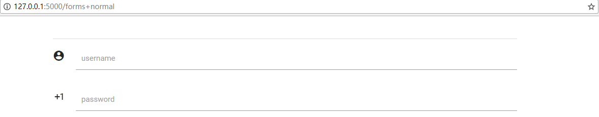

## Form

做数据交互时，表单是非常重要的一个部分。

我们应该如何写表单呢?  
像下面这个
[](./forms+normal.PNG)

代码如下给出
```python
form(
    Seq("<br>"*2,
        divider(),
        input_field(grid(l=10), 
                field_name='username', 
                type='text', 
                icon=Icons.account_circle,
                id='username'),

        input_field(grid(l=10),
                field_name='password',
                type='password',
                icon=icon('exposure_plus_1'),
                id='password'
            )
        )
    )
```

当然，有时候我们需要在一行填写多个字段。

[](./forms+multifields.PNG)

其实就是把两个输入放到一行而已。

```python
username = input_field(grid(l=5), 
                field_name='username', 
                type='text', 
                icon=Icons.account_circle,
                id='username')
password = input_field(grid(l=5),
                field_name='password',
                type='password',
                icon=icon('exposure_plus_1'),
                id='password')
a_row = row(Seq(username, password))
content = ["br"*2, divider(), a_row]
a_form = form(Seq(*content))
```

# 其他的表单填写形式

像单选和复选的字段以及文件上传，在当前版本的Incantation之中并未实现。这主要是我个人时间不足的问题。  
自然，这些没有提供的API实际上也是非常容易实现的。
Incantation在`incantation.Module.abst`中提供了非常强大的元类，我这里提供码源中form的实现，非常简短。

```python
from Incantation.Module.abst import abstract_object,indent_setter

class form(indent_setter, abstract_object):
    def init(self, content :(Seq,[input_field]), **attributes):
        body = \
"""
{{indent}}<form {{attributes_dict}}>
{{indent+Indent_unit}}{{content}}
{{indent}}</form>
"""
        self.conf.update(dict(content = content, indent = " ", attributes_dict = attributes))
        self.body = body

```

- indent_setter  
这是一个trait, 任何具有该特质的对象，在HTML代码生成前，可以以如下形式进行递归代码缩进。

    ```python
    obj.setIndent(1)
    obj.setIndent(2)
    ```

    一般来说,只需要对Page对象进行处理，就能递归设置所有对象的缩进.

    ```
    page = Page(main)
    page.setIndent(1)
    ```

- abstract_object  
这是一个元类，实现了所有incantation对象的公共方法。

详情见[abst.py](https://github.com/thautwarm/Incantation/blob/master/flowpython.incantation/Module/abst.py)

