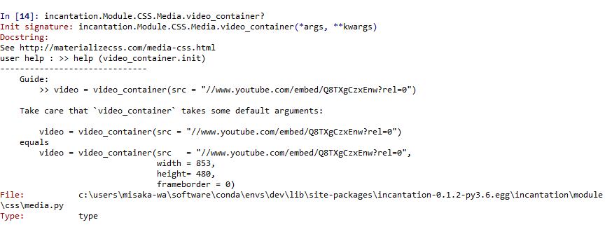

# 念诗 - 简体中文文档

## 开始

- Beginning

    - [配置静态文件](./static_conf.md)。  
    - [快速上手的例子](./hello_world.md)。

- Module模块  

    首先，对于所有incantation对象，当你不知道如何使用时，请使用`help`函数.  
    如果你有ipython解释器，那自然是极好的，因为你可以使用`?`或者`??`来获取更精准的Guide。
    

    - CSS
        - [颜色](https://github.com/thautwarm/Incantation/blob/master/docs/Chinese/CSS/color.md)
        - [布局](https://github.com/thautwarm/Incantation/blob/master/docs/Chinese/CSS/grid.md)
        - [Helpers](https://github.com/thautwarm/Incantation/blob/master/docs/Chinese/CSS/helpers.md)
        - [媒体](https://github.com/thautwarm/Incantation/blob/master/docs/Chinese/CSS/media.md)

        - 其他  
        其他组件均可通过在对象的`class`里添加对应值来应用。  
        例如在`class`的头部添加值，`obj.cons_class('btn btn-floating pulse')`;  
        或者在尾部进行`obj.append_class('btn btn-floating pulse')`。  
        原则上可以为对象的任何属性添加任何字符串，`obj.append_attr('class')('btn btn-floating pulse')`。

- Components

    - [徽章](https://github.com/thautwarm/Incantation/blob/master/docs/Chinese/Components/badges.md)
    - [表单](https://github.com/thautwarm/Incantation/blob/master/docs/Chinese/Components/form.md)

