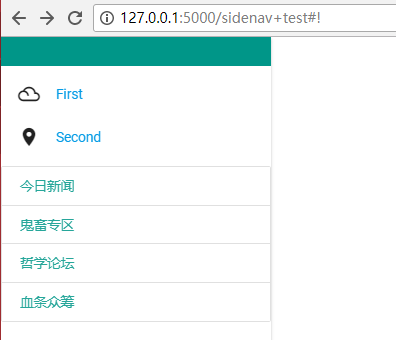

# DIY, so easy


是的，我的确没有将所有的Materialize-CSS组件翻译到Python，很惭愧，但是我还是做了一件小事。

**Incantation有无限的扩展性**

事实上，所有的组件都可以使用一些基本元素在几行内搞出来，在教程里，你所见到的所有东西，应该不存在实现代码超过10句话的(一句话可能超过1行，比如一个HTML的jinja2模板)。  
最关键的是，逻辑很简单。  
如果你有看一些教程，应该知道在`form`的教程中我给出了form的实现原理。
现在, 我们来实现一个侧边栏，首先看这样一段HTML代码:
[side_nav.md](./side_nav.md)

我们将之抽象为一个[Jinja2模板](http://docs.jinkan.org/docs/jinja2/):

```html
<script>$(document).ready(function(){
 $(".button-collapse").sideNav();
});
</script>
<ul id="{{id}}" {{attributes_dict}}>
    <li>
        <div class="userView">

            <div class="background {{background}}"></div>

            
            
                <a href="{{item.href}}">{{item.content}}</a>
            
            

        </div>
    </li>


    <li>
        {{component.gen()}}
    </li>

</ul>
<a href="#" data-activates="{{id}}" class="button-collapse"><i class="material-icons">menu</i></a>
```

然后自己写一个py文件，比如`Contribute/SideNav.py`.

```python
from Incantation.Module.abst import abstract_object,indent_setter, default_attr, attrset_sugar

class sidenav(indent_setter, abstract_object):

    @default_attr('class', 'side-nav fixed') 
    # attributes有默认属性 class = "side-nav fixed"
    # 可使用 obj.append_class(arg:str)和obj.cons_class(arg:str)添加class的值。
    def init(self, content, **attributes):
        sugar = attrset_sugar(self.conf, attributes)

        # self.conf 是用来渲染Jinja2模板的参数字典。
        
        sugar('id', 'slide-out') # 从attributes里取出id, 赋值给self.conf['id']中
        # 若attributes中不存在键id, 则赋值'side-out'给self.conf['id']

        sugar('background', 'teal')
        # 默认背景为 纯色teal

        sugar('header', None) # 默认不进行用户设置
        # 默认背景为 纯色teal

        body = \
"""
<script>$(document).ready(function(){
 $(".button-collapse").sideNav();
});
</script>
<ul id="{{id}}" {{attributes_dict}}>
    <li>
        <div class="userView">

            <div class="background {{background}}"></div>

            
            
                <a href="{{item.href}}">{{item.content}}</a>
            
            

        </div>
    </li>


    <li>
        {{component.gen()}}
    </li>

</ul>
<a href="#" data-activates="{{id}}" class="button-collapse"><i class="material-icons">menu</i></a>
""" 

        self.conf.update(dict(content = content, indent = '',  attributes_dict = attributes))
        self.body = body
```

然后创建一个这样的对象。

```python
content1 = \
collections([badge(new=True, href='#!', num=1, name='今日新闻'),
                badge(new=True, href='#!', num=4, name='鬼畜专区'),
                badge(href='#!', name='哲学论坛'),
                badge(new=False, href='#!', num=14, name='血条众筹'),
                
            ])
content2 = \
collapsible([(icon('filter_drama'),badge(href = '#!', name = "First") , "<p>Lorem ipsum dolor sit amet.</p>"),
                (icon('place'),       badge(href = '#!', name = "Second"), "place")
                ])
side = sidenav([content2, content1])
```

效果如下:  
[](./sidenav+test.PNG)


