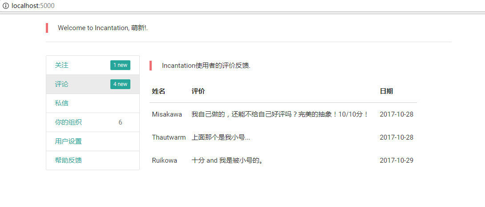

# 快速上手的例子

迄今为止，Incantation的API和materialize-css保持完全的一致。
我们举例子， 要使用`table`对象，在其在materialize-css的文档中处于CSS目录下,
[http://materializecss.com/table.html](http://materializecss.com/table.html)。  
则， `table`在Incantation中可以如此导出。
```python
from incantation.Module.CSS.Table import table
```
对于有些组件，例如`grid`，在materialize-css文档下与多个对象，包含`container`, `col`, `row`, `section`, `divider`，则在Incantation里，我们使用如下代码导出其中的对象。
```python
from incantation.Module.CSS.Grid import container, col, row, section, divider, grid
# grid 对象用来表示一个Incantation对象在大、中、小屏幕上所占的格数。屏幕一行为12格。
```

## Hello World

首先看这样一个简单的效果。
[](./hw.PNG)

它涉及到的materialize-css元素有

- container  
页面两侧是空的，所有东西都被放到了居中的container里。

- blockquote  
用来做小的提示。

- row  
将两个对象放到一行里。

- col  
指定一行内，哪些对象被作为一列对待。

- divider
分割线。

- grid
指定各个对象(在不同大小的用户屏幕上)所占的格数。

- table  
表格

- collections  
模拟边框的列表

- 我们给出代码 `hw.py`

    ```python
    from incantation.template import Page 
    from incantation.Module.abst import Seq

    from incantation.Module.CSS.Grid import container, col, row, grid, divider
    from incantation.Module import blockquote
    from incantation.Module.CSS.Table import table
    from incantation.Module.Component.Badges import collections, badge

    from flask import Flask, g, request, render_template, url_for, redirect


    def myPage(name):
        

        main = container() 

        welcome = blockquote(f"Welcome to Incantation, {name}!")

        title = blockquote("Incantation使用者的评价反馈")
        users = table(["姓名", "评价", "日期"],
                    [["Misakawa", "我自己做的，还能不给自己好评吗？完美的抽象！10/10分！", "2017-10-28"],
                    ["Thautwarm", "上面那个是我小号...", "2017-10-28"],
                    ["Ruikowa",  "十分 and 我是被小号的。", "2017-10-29"]
                    ])

        side = collections([badge(new = True,href = '#!', num = 1, name =  '关注'),
                            badge(new = True, href = '#!', num = 4, name = '评论'),
                            badge(href = '#!', name = '私信'),
                            badge(new = False,href = '#!', num = 6,name = '你的组织'),
                            badge(href = '#!', name = '用户设置'),
                            badge(href = '#!', name = '帮助反馈'),
                            ])

        main.contains(Seq(
                    welcome,
                    divider(),
                    "<br>",
                    row(Seq(
                            col(side,  grid(l=3, s=3, m=3)), 
                            col(Seq(title, users), grid(l=8, s=8, m=8)),
                            )
                        )
                    ))
        page = Page(main)
        return page.gen()


    app = Flask(__name__)
    app.debug = True

    @app.route('/', methods=['GET'])
    def index():
        return myPage("萌新")

    app.run('localhost')
    ```

执行`python index.py`后，直接访问[localhost:5000](http://localhost:5000/)即可。


